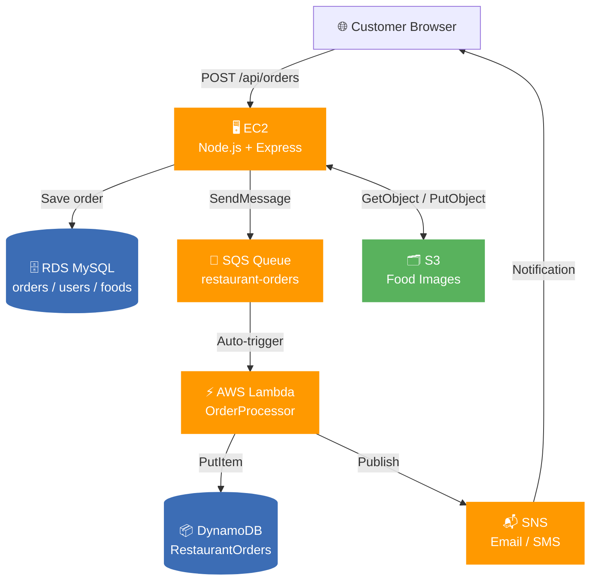

# ☁️ AWS Architecture — FoodHub Restaurant Order System

## Overview

FoodHub uses a **serverless, event-driven pipeline** on AWS to process customer orders asynchronously, decoupling the web server from order fulfillment logic.

---

## AWS Services Used

| Service | Role |
|---------|------|
| **EC2** | Hosts the Node.js Express backend + static frontend |
| **RDS (MySQL)** | Primary transactional database (orders, users, foods) |
| **SQS** | Async message queue — buffers order payloads |
| **Lambda** | Serverless processor — triggered by SQS automatically |
| **DynamoDB** | NoSQL store for enriched order analytics/archive |
| **SNS** | Sends email/SMS order confirmation to customers |
| **S3** | Stores food images uploaded by admin |

---

## Order Processing Flow

```
Customer Browser
      │
      ▼
 EC2 — Express API  (POST /api/orders)
      │
      ├──► RDS MySQL          ← Save order (source of truth)
      │
      ├──► SQS Queue          ← Push order payload (async)
      │         │
      │         ▼  (auto-trigger)
      │     AWS Lambda
      │         ├──► DynamoDB ← Store enriched order archive
      │         └──► SNS      ← Email/SMS to customer
      │
      └──► S3                 ← Food image reads
```

### Step-by-Step Breakdown

| Step | Actor | Action |
|------|-------|--------|
| 1 | Customer | Places order on website |
| 2 | EC2 / Express | Validates order, saves to **MySQL** (immediate) |
| 3 | EC2 / Express | Publishes order JSON to **SQS** queue |
| 4 | SQS → Lambda | Lambda is **auto-triggered** by SQS event |
| 5 | Lambda | Validates & enriches order (adds prep time, ETA) |
| 6 | Lambda | Stores enriched record in **DynamoDB** |
| 7 | Lambda | Publishes confirmation via **SNS** (email/SMS) |

---

## Architecture Diagram



---

## Code Mapping

### 1. SQS — Send order to queue
File: [sqs.js](file:///c:/Users/ajith/Downloads/Restaurant%20Order%20System/restaurant-order-system/backend/aws/sqs.js)

```js
// Called in orderController.js after saving to MySQL
const sqsResponse = await sendOrderToSQS(sqsPayload);
```

**Payload sent to SQS:**
```json
{
  "orderId": "ORD-XXXXXX",
  "name": "Customer Name",
  "phone": "9876543210",
  "email": "customer@email.com",
  "address": "123 Street, City - 600001",
  "items": [...],
  "total": 499.00,
  "payment": "COD",
  "status": "Pending",
  "createdAt": "2026-07-09T14:00:00.000Z"
}
```

---

### 2. Lambda — Process SQS message & write to DynamoDB
File: [lambda_function.js](file:///c:/Users/ajith/Downloads/Restaurant%20Order%20System/restaurant-order-system/backend/aws/lambda/lambda_function.js)

**What Lambda does:**
- Reads each `record` from the SQS batch event
- Validates required fields (`orderId`, `name`, `items`, `total`)
- Calculates preparation time: `20 + (itemCount × 2)` minutes
- Stores enriched record to **DynamoDB** with a `ConditionExpression` to prevent duplicates
- Emits **CloudWatch EMF metrics** (`ProcessedOrders`, `ProcessedRevenue`, `ProcessingErrors`)
- On failure → re-throws so SQS retries or routes to **Dead Letter Queue (DLQ)**

**DynamoDB record written:**
```json
{
  "OrderID": "ORD-XXXXXX",
  "CustomerName": "...",
  "Status": "Pending",
  "PreparationTimeMinutes": 26,
  "EstimatedDeliveryTime": "2026-07-09T14:41:00.000Z",
  "RiderAssigned": "Pending Rider Assignment",
  "Source": "SQS-Lambda",
  "ProcessedAt": "2026-07-09T14:00:05.000Z"
}
```

---

### 3. orderController.js — Orchestration
File: [orderController.js](file:///c:/Users/ajith/Downloads/Restaurant%20Order%20System/restaurant-order-system/backend/controllers/orderController.js#L60-L95)

```
POST /api/orders
  ├── 1. Validate items & coupon
  ├── 2. Calculate totals (subtotal, GST, delivery, tip, discount)
  ├── 3. Order.create() → MySQL
  ├── 4. sendOrderToSQS()    ← non-blocking try/catch
  └── 5. sendOrderNotification() ← non-blocking try/catch
```

> SQS and SNS failures are **non-fatal** — the order is saved in MySQL regardless,  
> ensuring customers always receive an order ID even if AWS services are unavailable.

---

## Environment Variables Required

```env
AWS_REGION=us-east-1
AWS_ACCESS_KEY_ID=your_access_key
AWS_SECRET_ACCESS_KEY=your_secret_key
SQS_QUEUE_URL=https://sqs.us-east-1.amazonaws.com/<account-id>/restaurant-orders
SNS_TOPIC_ARN=arn:aws:sns:us-east-1:<account-id>:restaurant-order-notifications
DYNAMODB_TABLE=RestaurantOrders
S3_BUCKET=restaurant-images-bucket
```

---

## IAM Permissions Required

### EC2 Instance Role
```json
{
  "Effect": "Allow",
  "Action": [
    "sqs:SendMessage",
    "sns:Publish",
    "s3:PutObject",
    "s3:GetObject",
    "dynamodb:PutItem",
    "dynamodb:GetItem"
  ],
  "Resource": "*"
}
```

### Lambda Execution Role
```json
{
  "Effect": "Allow",
  "Action": [
    "sqs:ReceiveMessage",
    "sqs:DeleteMessage",
    "sqs:GetQueueAttributes",
    "dynamodb:PutItem",
    "sns:Publish",
    "logs:CreateLogGroup",
    "logs:CreateLogStream",
    "logs:PutLogEvents"
  ],
  "Resource": "*"
}
```

---

## Deployment Checklist

- [ ] Launch EC2 (Amazon Linux 2 / Ubuntu, t3.micro)
- [ ] Create RDS MySQL 8.0 (`db.t4g.micro`)
- [ ] Create SQS Standard Queue → `restaurant-orders`
- [ ] Create DynamoDB table → `RestaurantOrders` (PK: `OrderID` String)
- [ ] Deploy Lambda from `backend/aws/lambda/` (Node.js 20.x)
  - [ ] Add SQS trigger → `restaurant-orders` queue
  - [ ] Set env var `DYNAMODB_TABLE=RestaurantOrders`
- [ ] Create SNS Topic → `restaurant-order-notifications`
  - [ ] Add email subscription & confirm
- [ ] Create S3 Bucket → `restaurant-images-bucket`
- [ ] Attach IAM role to EC2 with required permissions
- [ ] Update `.env` with all AWS resource ARNs/URLs
- [ ] Start with PM2: `pm2 start server.js --name restaurant`
